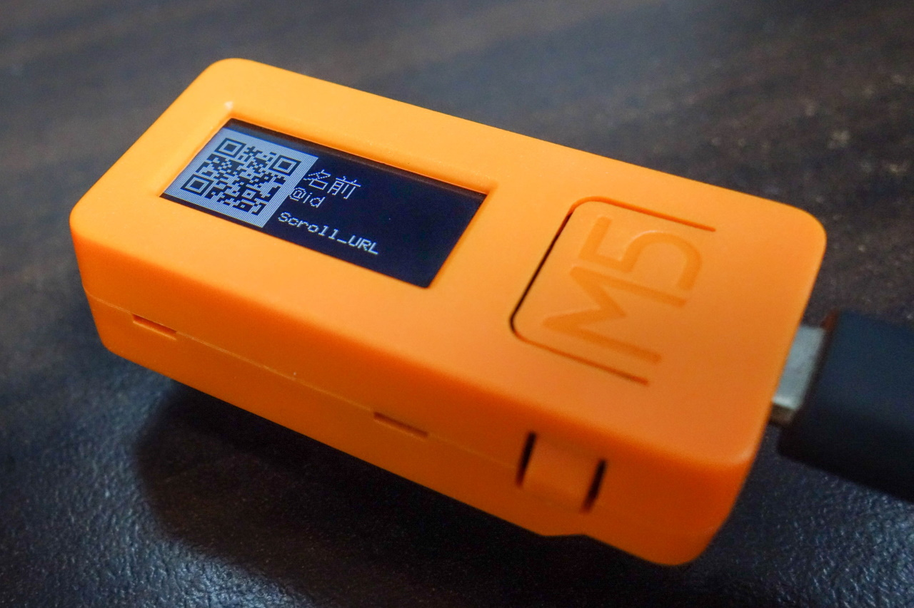

# M5StickC用 電子名刺

M5StickC用の電子名刺.
アイコンやQRコードの表示が可能.

コミックマーケット98用に作成したArduinoスケッチを汎用化したもの.



## 開発環境

- [M5StickC](https://docs.m5stack.com/#/en/core/m5stickc)
- [Arduino 1.8.12](https://www.arduino.cc/)
  - ESP32 1.0.4
  - M5StickC Library 0.11
  - [efont Unicode BDF Font Data](https://github.com/tanakamasayuki/efont)

## 操作方法

- Aボタン
  - アイコン / QRコード 切り替え
- Bボタン
  - バックライト輝度調整

## 表示内容の変更

### 名前, ID

`m5stickc-visiting-card.ino` の定数 `name_string`, `id_string` を編集する.
efontを読み込むので日本語表示が可能.

```cpp
    constexpr char* name_string = "名前";
    constexpr char* id_string = "@id";
```

### スクロール文字

URLなどに使用. `scroll-url.h` の定数 `string` を編集する.

こちらはSpriteを使用している関係でefontで表示しておらず, 英数字のみ対応.

```cpp
    static constexpr const char* string = "Scroll_URL";
```

### QRコード

`qr-state.h` の定数 `url` を編集する. `version = 2` では31バイトまで.

カメラの性能にもよるが, 64x64ドットでの表示のため読み取りはかなり厳しい.
周囲の明るさやフォーカスを合わせると読み取りに成功しやすい.

```cpp
    static constexpr const char* url = "QR_URL";
```

### アイコン

64x64ドットのPNG画像を用意しておく.

M5StickCはMicroSDカードスロットを持っていないため, 予め生バイナリに変換してソースコードに埋め込む必要がある.

意外とWindowsでも動作する生バイナリへの変換プログラムがなかったので, .NET Coreで変換処理を行う [bmp2hex-dotnet-core](https://github.com/nnm-t/bmp2hex-dotnet-core) を作成した.
これを使用するとC/C++形式の配列データへ変換できる.

`icon-image.h` の配列値を置き換えたら完了.

```cpp
constexpr const uint16_t icon_image[] = { (略) };
```
